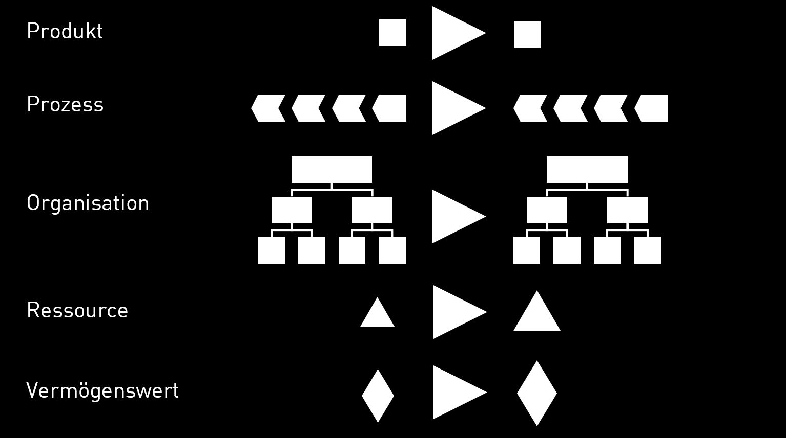

# 2022-WS: Digital Organization

v1.0.0

> "Experience rather then watch!"
>
> — Ulrich Anders

---

## Innovation?

---

## Adventure?

[https://www.pechakucha.com/presentations/a-quest-for-adventure](https://www.pechakucha.com/presentations/a-quest-for-adventure)

---

## Adventure

> "Getting out of the comfort zone: mentally, socially, spiritually, physically"
>
> — Allister Humphry

---

## WHY


---

## ORGANIZATIONAL ELEMENTS



---

## WHAT

- Structural Organization
- Process Organization
- Cooperation Model
- Continuous Deployment
- Robotics Technology for Automation

---

## HOW

- (Markdown)
- Understanding digital workflow
- GitHub
- Ideal Organization
- Your own orgchart

---

## BLENDED LEARNING

- Designing Organisations
- A robotics database
- BPMN

---

## CHALLENGES

- Technology
- Rights
- Computers

---

## BLOG

[https://github.blog/2020-09-10-announcing-the-github-integration-with-microsoft-teams/](https://github.blog/2020-09-10-announcing-the-github-integration-with-microsoft-teams/)

---

### Understand Terminal Commands

1. [Pocket Guide Linux Commands](kesavanbr_pocket-guide-linux-commands.pdf)

1. [Linux Commands Cheatsheet](Linux-commands-cheatsheet.pdf)

1. [Linux Command Line.pdf](davechild_linux-command-line.pdf)

---

### Pre-requisites I

- Always backup your computers properly.

- Please install the following software:

  - VS Code: https://code.visualstudio.com/

  - GitHub Desktop: https://desktop.github.com/

  - XnView: https://www.xnview.com/en/xnviewmp/

  - PCs: git: https://git-scm.com/

---

### VS Code

- Please install the following plugins:

  - Code Spellchecker
  - German - Code Spellchecker
  - Atom Keymap
  - Color Highlight
  - File Utils
  - Markdown Preview
  - GitHub Markdown Preview
  - Prettier

---

### git (only PCs)

- In git-scm please choose the following options:

  - Use Visual Studio Code as Git’s default editor
  - Use Git and optional Unix tools from Command Prompt
  - Use the OpenSSL library
  - Checkout Windows-style, …
  - Use Windows’ default console window

---

- ....

  - Default

  - Git Credential Manager (i.e. NOT the Git Credential Manager Core)

  - ON: Enable file system caching<br/>

  - OFF: Enable symbolic links

  - OFF: Enable experimental support …

---

### Pre-requisites II

- Please install the following software:

  - Chrome: https://www.google.com/chrome/?brand=CHBD&gclid=EAIaIQobChMI7L6QysrR6wIVYoBQBh04vgqJEAAYASAAEgIygvD_BwE&gclsrc=aw.ds

  - XnView MP, if you want to edit pictures: https://www.xnview.com/en/

  - For drawing pictures you can use Powerpoint or Paint 3D

---

### Test git

- Open command shell / terminal. Type

  ```sh
  git --version
  ```

- If further installations are necessary, e.g. Mac Developer Tools, please carry them out.

---

### Node

- Install node 16.13.1 LTS: https://nodejs.org/en/

- Open command shell:

  ```sh
  node --version
  ```

- ON MAC: You need to give proper permissions:

  [https://docs.npmjs.com/resolving-eacces-permissions-errors-when-installing-packages-globally](https://docs.npmjs.com/resolving-eacces-permissions-errors-when-installing-packages-globally)

---

### GitHub

- Sign on into GitHub.

- Recommendation is to use `firstnamelastname` in small letters or a similar name as user name: https://github.com/

- Enter this account also in GitHub Desktop.

---

### GitHub Repository

- Make a new GitHub Repository on GitHub, e.g. `2020-ss_doxy`, where you replace `xy` with your initials.

- Clone this repository onto your local harddrive. For this you can use `GitHub Desktop` or

```sh
git clone path-to-your-repository.git
```

---

### slides.md

- Generate a `slides.md` file in the locally cloned folder. As a first content you can use the content from [https://github.com/webpro/reveal-md](https://github.com/webpro/reveal-md), i.e.

```md
# Title

- Point 1
- Point 2

---

## Second slide

> Best quote ever.

Note: speaker notes FTW!
```

### reveal-md

- You are going to use `reveal-md`.

- Open the terminal and install globally by:

```sh
npm install -g reveal-md
```

If you get access errors messages, fix them. See slide **Node**.

Afterwards, please read:

https://github.com/webpro/reveal-md

---

### Camunda

- Please also download

- Camunda: https://camunda.com/download/modeler/

---

### Markdown

- Play around with Markdown (we will cover this also in the lecture!)

- https://www.markdownguide.org/getting-started/

- https://github.com/adam-p/markdown-here/wiki/Markdown-Cheatsheet

- https://code.visualstudio.com/docs/languages/markdown

---

### Markdown (text formatting)

**bold**

~~strikethrough~~

_italics_

---

### Markdown (bullets)

```md
- bullet
- more bullets
  - indented
  - bullets
```

- bullet
- more bullets
  - indented
  - bullets

---

### Markdown (lists)

```md
1. Don't get
1. confused
1. markdown counts up
1. and 1. is a command.
```

1. Don't get
1. confused
1. markdown counts up
1. and 1. is a command.

---

### Markdown (headers)

# # H1

## ## H2

### ### H3

#### #### H4

##### ##### H5

###### ###### H6

---

### Markdown (images)

```md

```


---

### Markdown (links)

```md
[https://ulrich-anders.eu](https://ulrich-anders.eu)
```

[https://ulrich-anders.eu](https://ulrich-anders.eu)
